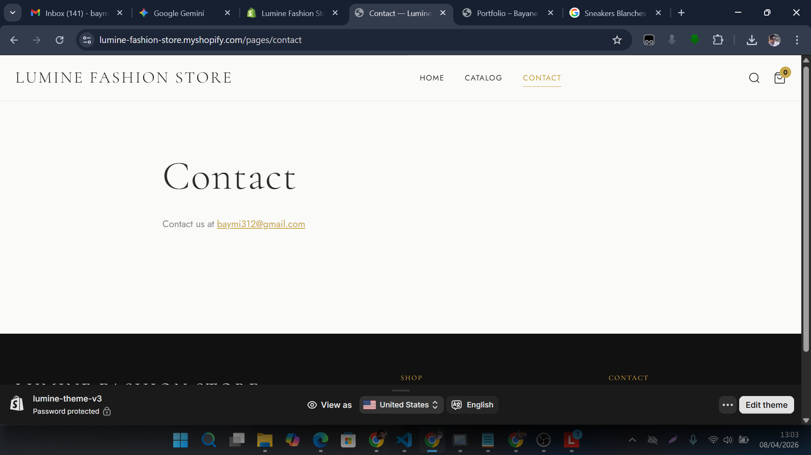
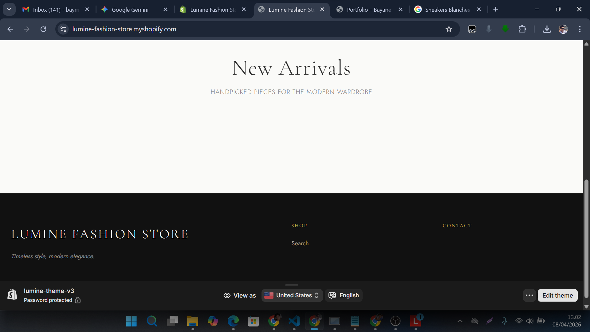
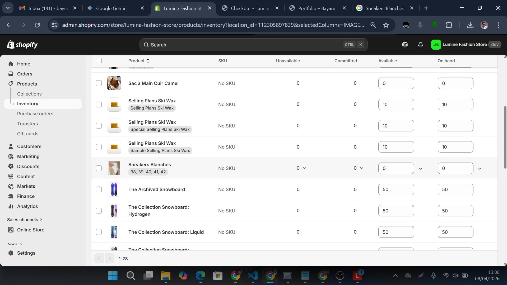

# Lumine — Shopify Theme (OS 2.0)

Custom Shopify **Online Store 2.0** theme built with **Liquid**, focused on a modern fashion store experience.

## Demo
- Store: `https://lumine-fashion-store.myshopify.com`
- Note: Development stores are password-protected by Shopify.
- Password: (add in README if you want recruiters to access the live demo)

## Features
- Home / Collection / Product templates (Liquid + Sections)
- Variant selection UI
- AJAX add-to-cart
- Cart drawer UI
- Responsive layout

## Screenshots

## Tech Stack
- Shopify Liquid (OS 2.0)
- HTML / CSS
- JavaScript (vanilla)

## Theme Structure
- `layout/` — global layout
- `templates/` — JSON templates
- `sections/` — OS 2.0 sections
- `snippets/` — reusable Liquid parts
- `assets/` — CSS/JS/images

## Installation
1. Zip the theme folder.
2. Shopify Admin -> Online Store -> Themes -> **Add theme** -> **Upload zip**.

## Author
Bayane
